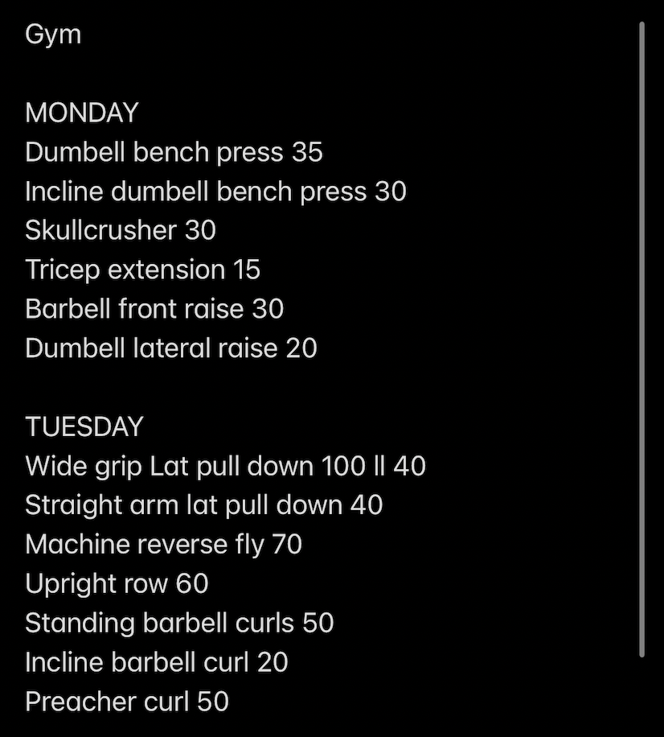
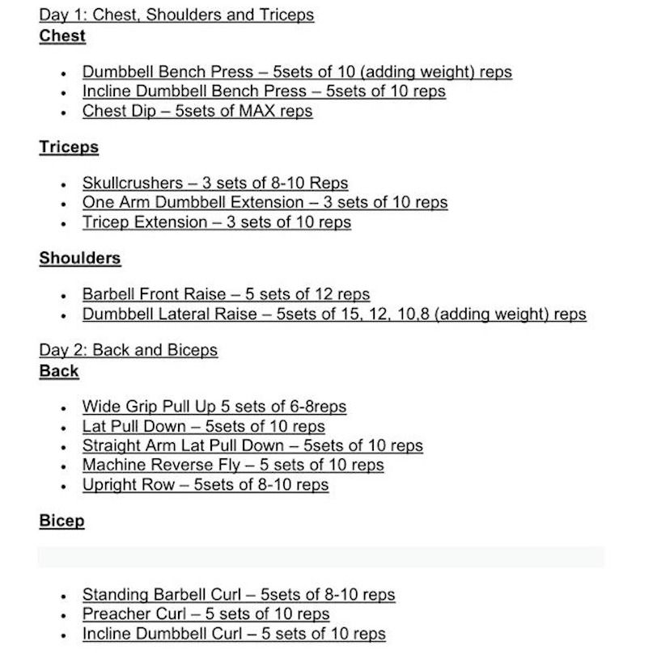
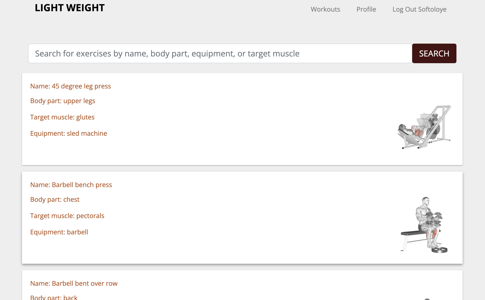
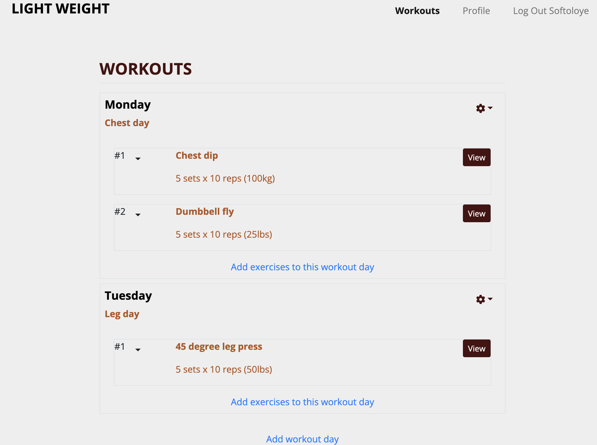
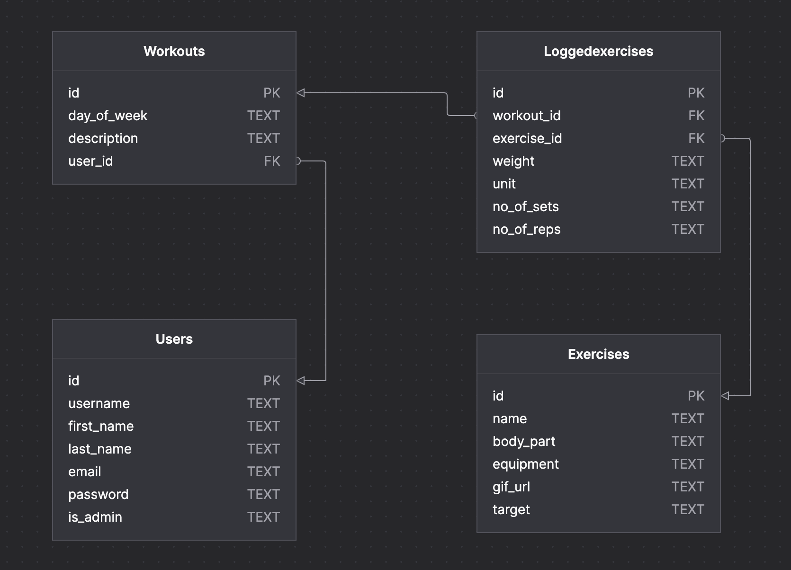

# Light Weight

## Overview

**LIVE LINK **: https://old-fashioned-ink.surge.sh/

This is a full-stack application for users to search and plan their exercises. Before now, my daily exercises were saved as screenshots on my phone, and the weights I exercised with were typed on the notes app on my phone.

 

Every morning, I had to scroll through my gallery to see my exercises for the day. I updated the weights I exercised with by typing the figures down on my notes app. This was not so much of a tedious process, but I knew I needed some automation, so I built light weight to help me with the whole process.

The API for this website - that provides exercises for users to select from - was built from scratch using Node JS. The information on the API were gotten from [ExerciseDB](https://rapidapi.com/justin-WFnsXH_t6/api/exercisedb/), and [Wger.de](https://wger.de/en/workout/overview) was as an inspiration for the building of the user interface.

## Features

- Ability to sign up and log in
- Functionality for searching and selecting from the list of exercises provided by the backend
- Ability to edit, and delete selected exercises and workouts
- Limitless number of exercises can be added to any day of the week
- Ability to create, edit, update, and delete weights with which exercises are performed

|  |
| :------------------------------------------------------------------------: |
|                  _Exercises search page on Light Weight_                   |

|  |
| :-----------------------------------------------------: |
|             _Workouts page on Light Weight_             |

## Technologies used

- React
- Node
- Express
- PostgreSQL

## Dependencies

- [React-bootstrap](https://react-bootstrap.github.io/)
- [Jsonschema](https://json-schema.org/understanding-json-schema/)
- [jsonwebtoken](https://jwt.io/)
- [axios](https://axios-http.com/docs/intro)
- [bcrypt](https://www.npmjs.com/package/bcrypt)
- [dotenv](https://www.npmjs.com/package/dotenv)
- [morgan](https://www.npmjs.com/package/morgan)
- [pg](https://www.npmjs.com/package/pg)

## API

- [Light Weight API](https://lightweight-backend.herokuapp.com/)

## Deployment

- Backend and Frontend: heroku

## Database schema

- A postgreSQL database is used to implement the database schema. The database schema is made up of 4 tables: user, workouts, exercises, and loggedexercises.
- The relationships between these tables are shown on the image below.

## Getting started

- Clone this repository with `git clone https://github.com/promisethedeveloper/lightweight`
- Run `cd lightweight-backend` and run `npm install` to install all backend dependencies
- Run `npm start` to start the backend
- Run `cd..`
- Run `cd lightweight-frontend` and run `npm install` to install the frontend dependencies
- Run `npm start` to start the frontend
  Once you have completed the steps above, you will have a ready-to-go copy of Light Weight on your local machine.

## Backend testing with jest

- Navigate to `lightweight/lightweight-backend`
- Run in terminal:
  `npm run test`

## Restful API routes

- The server is started on http://localhost:3001 and all the routes are listed below

| HTTP Verb |            Route             |         Meaning          |
| :-------: | :--------------------------: | :----------------------: |
|   POST    |         /auth/token          |   Authentication User    |
|   POST    |        /auth/register        |      Register User       |
|   POST    |          /exercises          | Create exercises (Admin) |
|    GET    |          /exercises          |    Find all exercises    |
|    GET    |      /exercises/[name]       |       Get exercise       |
|   PATCH   |      /exercises/[name]       | Update exercise (Admin)  |
|  DELETE   |      /exercises/[name]       | Delete exercises (Admin) |
|   POST    |       /loggedexercise        |     Log an exercise      |
|    GET    | /loggedexercise/[workout_Id] |   Get logged exercise    |
|   PATCH   |     /loggedexercise/[id]     |  Update logged exercise  |
|  DELETE   |     /loggedexercise/[id]     |  Delete logged exercise  |
|   POST    |            /users            |   Create User (Admin)    |
|    GET    |            /users            |  Get all Users (Admin)   |
|    GET    |      /users/[username]       |         Get User         |
|   PATCH   |      /users /[username]      |       Update User        |
|  DELETE   |      /users/[username]       |       Delete User        |
|   POST    |       /workouts/[day]        |      Create workout      |
|    GET    |          /workouts           |     Get all workouts     |
|    GET    |     /workouts/[username]     |       Get workout        |
|   PATCH   |       /workouts/[day]        |      Update workout      |
|  DELETE   |       /workouts/[day]        |      Delete workout      |

## Frontend testing with react testing library

- Navigate to `lightweight/lightweight-frontend`
- Run in terminal:
  `npm run test`

## Frontend components

|             |
| :-----------------------------------------------------------------: |
| _Diagrammatic representation of Light Weight components and states_ |
